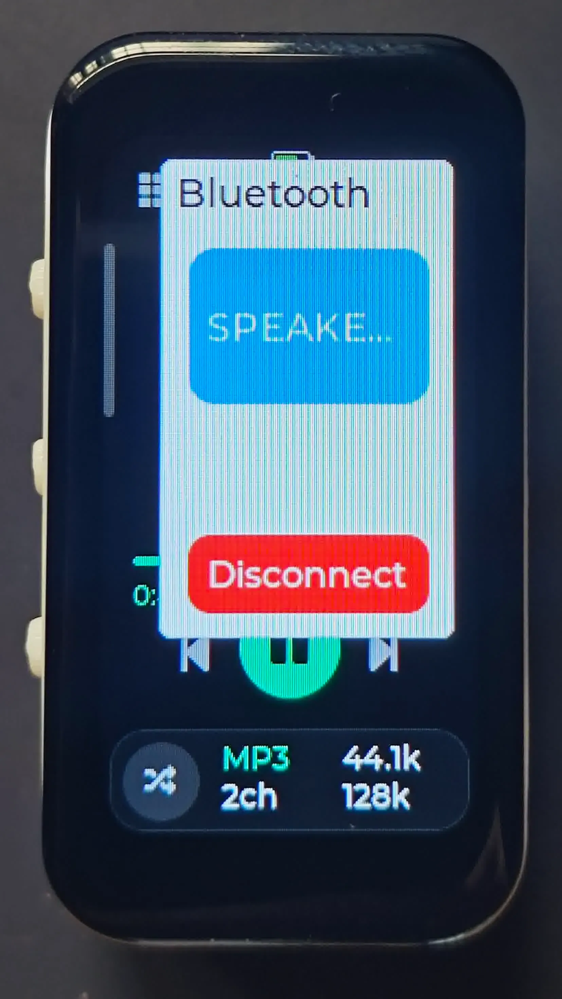
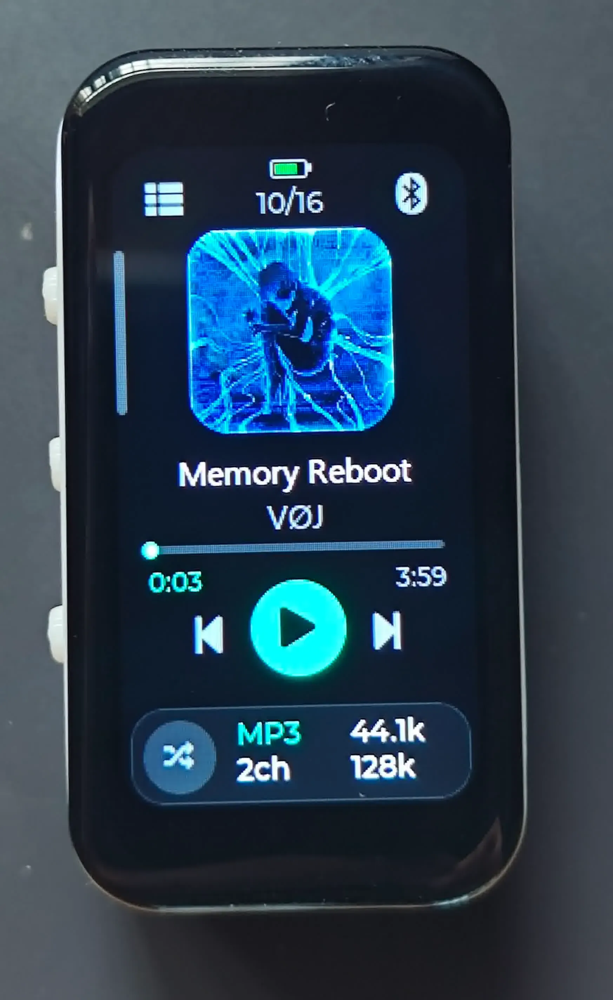
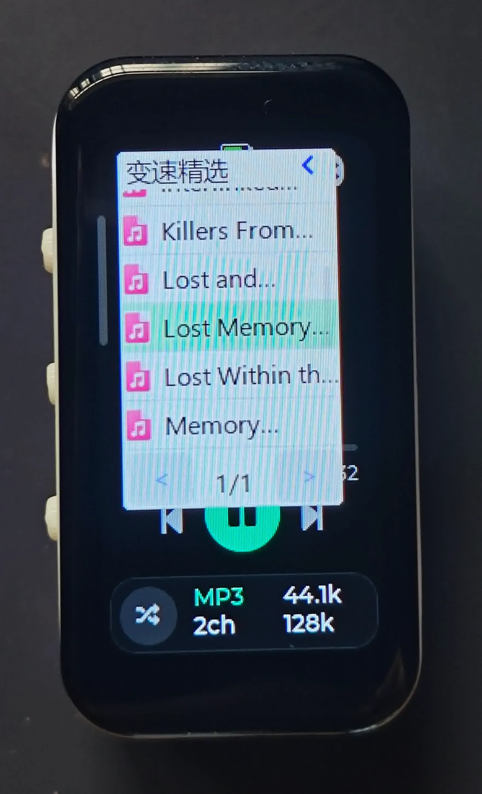
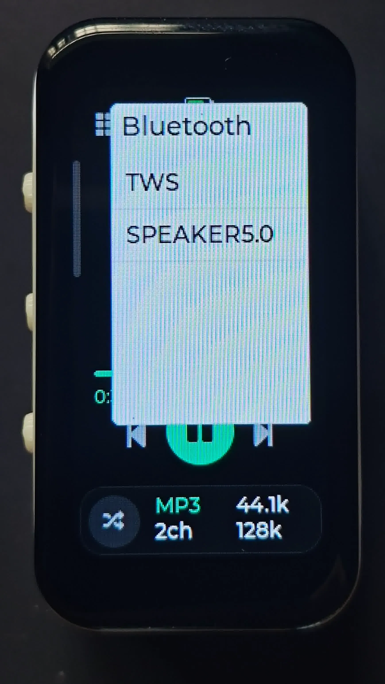
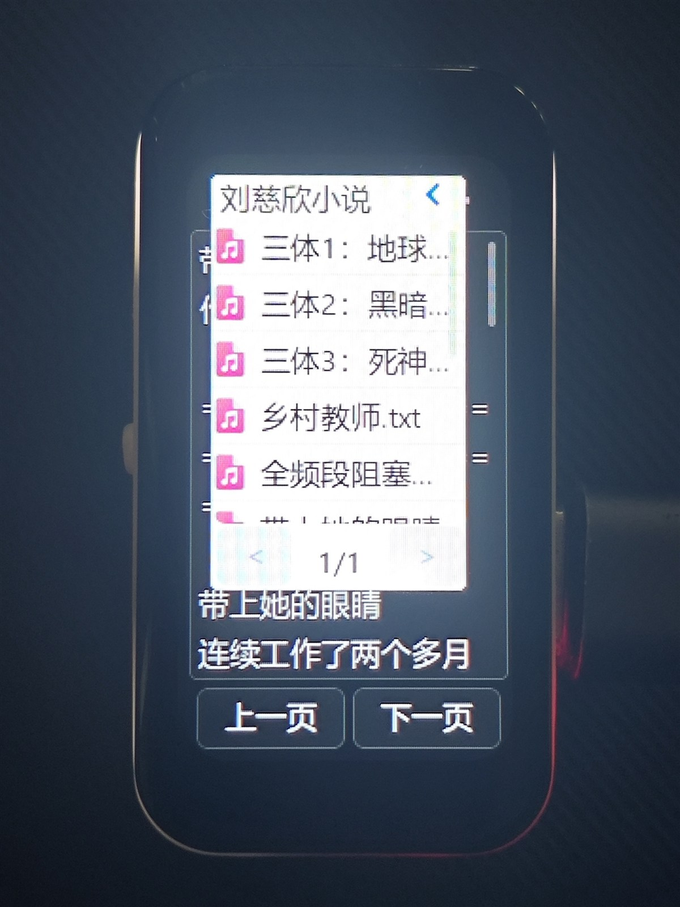
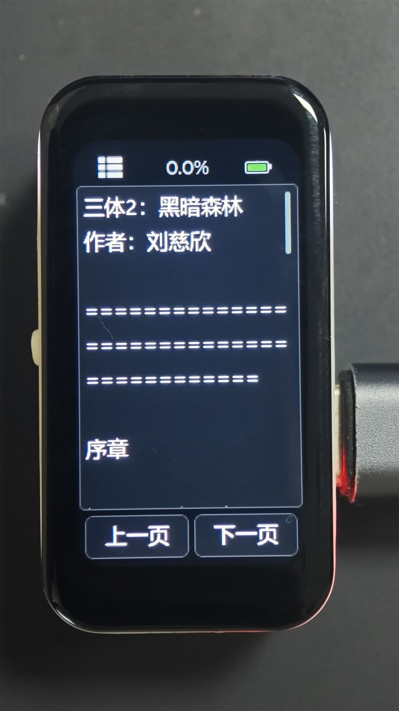
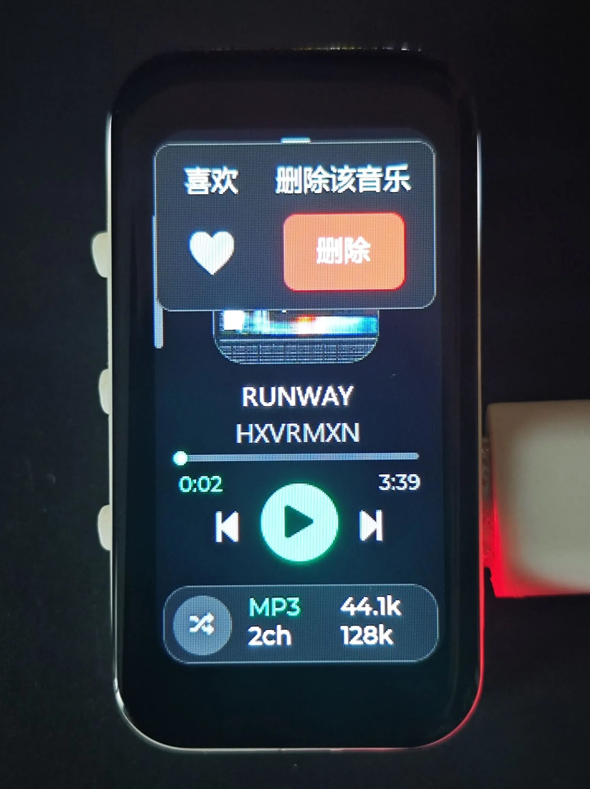
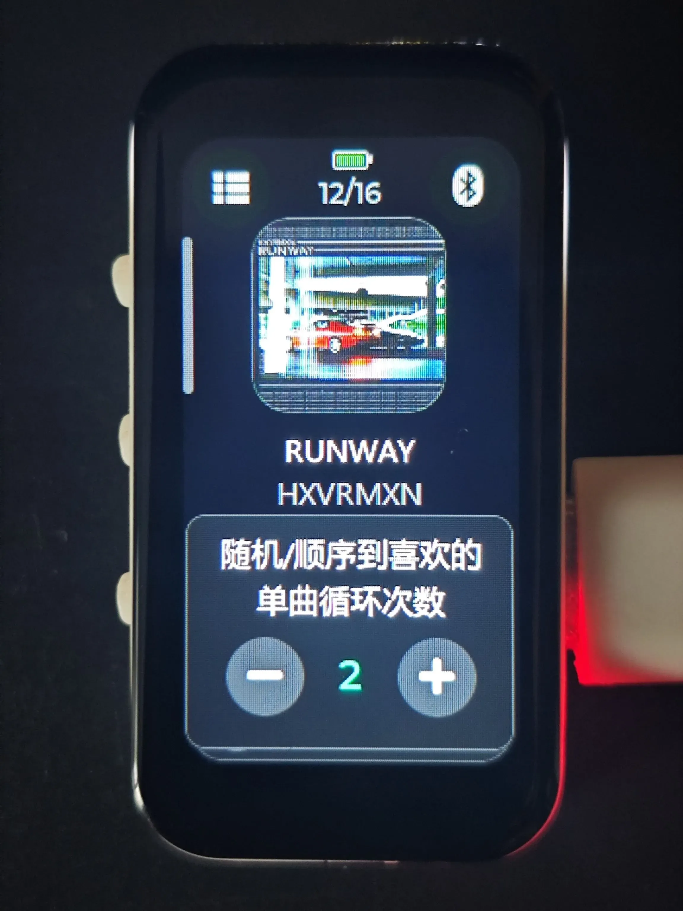
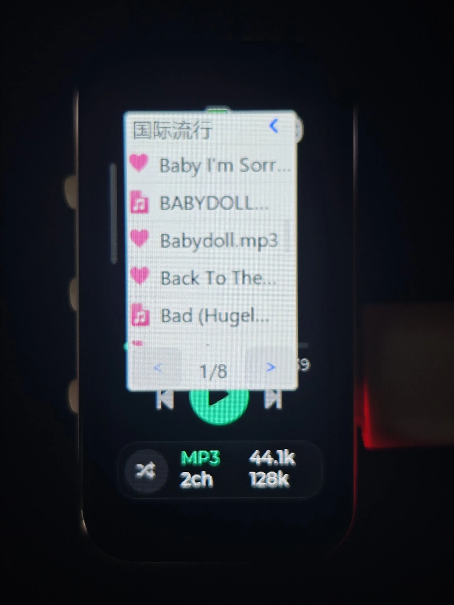

<div align="center">

# music_nano

比拇指大小的迷你音乐播放器 · ESP32 + 蓝牙 Classic A2DP

</div>

## 项目概述

music_nano 是一款比拇指大小的迷你音乐播放器，整机仅 2.2cm × 4.2cm、厚 8mm（不含电池），能轻松塞进任何口袋。它由 ESP32 驱动，通过蓝牙 Classic A2DP 把音乐无线推送给耳机或音箱。

<p align="center">
  
  
  
  
</p>

## 演示视频

[哔哩哔哩 · BV1nEtp6qE72](https://www.bilibili.com/video/BV1nEtp6qE72?t=42.2)

## 功能特性

- **音频解码**：MP3 / FLAC / WAV，最高支持 48kHz / 16bit / 320kbps
- **蓝牙输出**：Classic A2DP 无线播放，支持设备扫描与一键连接
- **耳机控制**：通过 AVRCP 在耳机上直接播放/暂停/上一曲/下一曲/音量±
- **文件浏览**：MicroSD 音乐库，按目录分组，支持热插拔检测与自动扫描缓存
- **专辑封面**：自动解析 MP3/FLAC 内嵌封面并显示
- **播放模式**：顺序 / 单曲循环 / 随机
- **设置持久化**：音量、亮度、上次播放歌曲、播放模式掉电保存（NVS）
- **系统监视**：实时显示电池电压与 CPU 温度
- **电源管理**：背光渐变、一键息屏（蓝牙保持连接）、深度睡眠
- **串口控制台**：内置命令可直接操作扫描/连接/播放/调试

## 硬件平台

| 项目 | 规格 |
| --- | --- |
| 主控 | ESP32 双核 240MHz 2M PSRAM |
| 显示屏 | 172×320 全彩 LCD（JD9853，SPI 接口） |
| 音频输出 | 蓝牙 Classic A2DP（无线） |
| 外部存储 | MicroSD 卡（热插拔检测） |
| 电池 | 滑块式可插拔，无内置固定电池 |
| 按键 | 息屏 / 唤醒键 |
| 交互 | 全图形化 LVGL 界面 |

## 尺寸与外观

- 宽：2.2cm
- 长：4.2cm
- 厚：8mm（不含电池）

## 电池与续航

采用**滑块式可插拔电池**设计，电池像推卡片一样滑入滑出，随时可更换。整机不带固定电池。
续航取决于你随身带几块电池——带一块听一块，没电了换一块接着听。

## 功耗

以下功耗均在播放 MP3 44.1kHz / 128kbps 音乐的条件下实测：

不使用蓝牙：

| 场景 | 功耗 |
| --- | --- |
| 不使用蓝牙，亮度最大 | ≈ 0.7W |
| 不使用蓝牙，亮度中等 | ≈ 0.3W |
| 不使用蓝牙，亮度最低 | ≈ 0.25W |
| 关闭蓝牙并休眠 | ≈ 14mW |

开启蓝牙：

| 场景 | 功耗 |
| --- | --- |
| 开启蓝牙，亮度最低 | ≈ 0.6W |
| 开启蓝牙，亮度中等 | ≈ 0.7W |
| 开启蓝牙，亮度最大 | ≈ 1.0W |
| 开启蓝牙，播放音乐并息屏 | ≈ 0.6W |

## 解码能力

- 最高支持 **48kHz / 16bit / 320kbps** 的 MP3 与 FLAC
- 播放该规格音乐时，音频解码任务 CPU 占用约 **60%**，中间转换层约 **15%**
- 再高（例如 96kHz）会开始卡顿

ESP32 无 FPU，所有解码与重采样均为纯整数定点实现，音频最终统一重采样到 44.1kHz / 16bit / 立体声后通过蓝牙推送。

## 软件架构

基于 ESP-IDF + FreeRTOS，按功能域拆分为多个独立任务，任务间通过队列解耦：

- **蓝牙任务**：A2DP / AVRCP 协议栈、设备扫描与连接管理
- **音频任务**：解码（MP3/FLAC/WAV）→ 定点重采样 → 推流
- **UI 任务**：LVGL 图形界面与交互
- **封面解码任务**：独立解码内嵌专辑封面，不阻塞播放
- **系统监视任务**：SD 卡管理、电池电压 / CPU 温度采样

启动流程做了专门优化：bootloader 阶段即完成 LCD 硬件上电时序，把开机黑屏时间压缩到最短。

## 目录结构

- `main/audio/` 解码器与定点重采样
- `main/bt/` 蓝牙 A2DP
- `main/ui/` LVGL 界面
- `main/power/` 电源管理
- `main/storage/` SD 卡与音乐扫描
- `main/drivers/` 显示屏驱动
- `main/app/` 设置持久化与串口控制台

## 构建说明

需要 **ESP-IDF ≥ 5.5.5**（低版本存在 SPI 总线死锁 bug）。

```powershell
. $env:IDF_PATH\export.ps1   # 导出 ESP-IDF 环境
idf.py set-target esp32
idf.py build
idf.py -p COMx flash monitor
```

本仓库还提供 `build.ps1`（过滤噪声的构建包装脚本）与 `mem-analyze.ps1`（ELF 内存占用分析），详见 [BUILD.md](BUILD.md)。

## 更新日志

### 2026.9.30

**新增**
- 小说阅读模式：SD 卡小说分组扫描 + 复用文件浏览器选书，长按睡眠键在音乐/小说间切换（黑屏过渡 + 光圈缩放动画）
- 小说阅读体验：GBK / UTF-8 / BOM 自动编码识别、分块渲染、阅读进度记忆与恢复，文件浏览器可定位当前小说
- 蓝牙被动连接：耳机 / 手机可主动连入播放器，无需在播放器上操作
- 音量细调 32 档：硬件 8 步进 + 低档 PCM 软件增益拉平，耳机回传的绝对音量映射到最近档位
- 深睡省电：切电后将已配置 IO 复位为高阻，消除经断电外设的灌流

**优化**
- 模式切换动画改为光圈缩放合成动画
- SD 卡读取改流式：挂载时预置持久 DMA 缓冲 + 20KB PSRAM 线性预读，消除偶发读失败导致的秒切歌
- 蓝牙配对改用 Just Works（无需比对数字），修复挂起时初始化竞态导致的卡死
- 深睡放电延时、电池满电处理、列表滚动降耗等系统调优
- 新增 `taskmem` 命令查看各任务栈峰值，`ram` 命令增加 DMA 余量打印

**修复**
- 修复 seek 后采样率/声道被误判导致的变速、变调（MP3 按真实帧头链式重同步并锁定每首首次格式；WAV 对齐 PCM 帧边界）
- 修复小说编码识别失败时无提示，增加失败重扫弹窗
- 内部稳定性修复若干

<p align="center">
  
  
</p>

### 2026.9.25

**新增**
- 收藏：播放页长按封面可收藏/取消，文件浏览器显示爱心图标
- 删除歌曲：长按封面二次确认删除，自动修正随机播放记录
- 循环次数：长按模式键设置每首重复 1~9 次（仅收藏歌曲生效）
- 随机去重：随机播放不再重复，全播完自动重新开始

**优化**
- 启动更快：开机提速约 200ms，文件浏览器响应 300ms → 80ms
- 触摸改中断驱动，降低卡顿与功耗
- 音乐库改用单文件索引，扫描更快、支持目录名含 `/`

**修复**
- 修复插拔 SD 卡偶发崩溃、蓝牙连接卡死、封面右边缘错位等问题
- 内部稳定性修复（越界/内存泄漏/数据撕裂）若干

<p align="center">
  
  
  
</p>

## 许可证

本项目基于 [MIT License](LICENSE) 开源。第三方组件（LVGL、JPEGDEC、micro-mp3、micro-flac、esp_lcd_jd9853 等）遵循其各自许可证，详见 [THIRD_PARTY.md](THIRD_PARTY.md)。
